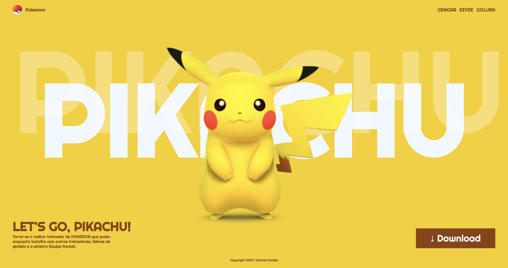

# Landing page - Let's Go, Pikachu

## Sobre

Site do tipo Landing Page para dilvulgar o jogo Let's Go Pikachu.
O intuito desse projeto é colocar em prática o conhecimento adquirido sobre as linguagens de marcação, HTML, CSS e Markdown, realizadas no curso técnico de desenvolvimento de sistemas [SENAI Jandira](https://sp.senai.br/unidade/jandira/).

## Tecnologia utilizadas
- HTML;
- CSS;
- Markdown;
- GIT

##Autor

-[Gabriel Silva Guedes]()